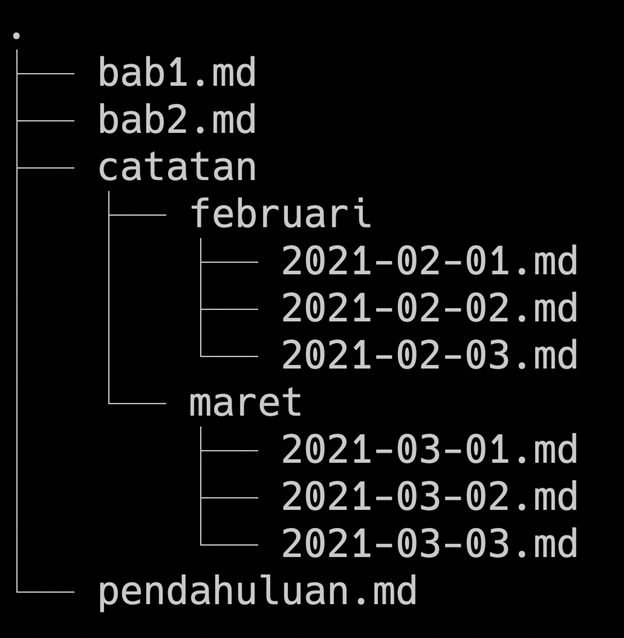
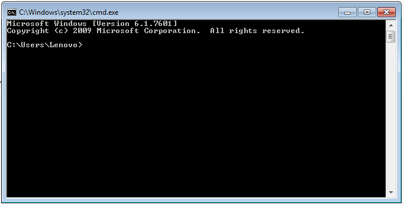

# Rangkuman Minggu Pertama SKILVUL

## UNIX COMMAND LINE

1. **CLI (Command Line Interface)** adalah baris perintah dari user melakukan perintah berbasis teks dengan berinteraksi dengan shell untuk melakukan perintah ke system operasi.

2. **Shell** adalah program berbasis teks antara user dengan system operasi, sebagai penerjemah menerima lalu memproses ke system untuk dieksekusi.
3. **Terminal** adalah tempat untuk mengetikan perintah teks ke system operasi dan akan diterjemahkan oleh shell.
4. **File System Structure** adalah penyusunan struktur file dan folder dalam bentuk pohon. contohnya seperti ini :
> 
5. **Mengakses CLI**
Klik logo windows dan ketik Cmd.exe maka hasil akan seperti dibawah :
> 
6. **Command** 
- ***pwd (Print Working Directory)***  Melihat Directory yang sedang bekerja.
- ***dir*** melihat isi direktori
- ***cd (change directory)*** berpindah direktori
- ***ls (list)*** melihat isi file pada direktori
- ***mkdir (make directory)*** membuat direktori
- ***touch*** membuat file
- ***cp*** mengcopy file dan direktori
- ***mv*** memindahkan dan mengganti file atau folder
- ***rm*** menghapus file
- ***rm -r*** menghapus direktori

## Git dan Github

- **Git** Tools programmer sebagai visual control system dimana mencatat perubahan yang kita buat pada code baik individu maupun tim.
- **Github** Sebuah website yang digunakan programer untuk mengembangkan dan mendesign sebuah software. Selain Github ada ***Gitlab*** dan ***Bitbucket*** untuk penyimpanan hasil project dalam bentuk repository

### Kenapa harus menggunakan Git dan Github
Tujuan utamanya untuk dapat berkelaborasi dengan tim tanpa membuat file yang banyak. Dan dapat mengerjakan secara bersamaan tanpa harus menunggu satu sama lain sehingga proses pengerjaan jauh lebih cepat.

### Langkah - langkah pengunaan Git dan Github

1. Download Gitbash melalui [link GIT](https://git-scm.com "silahkan download GIT dahulu")
2. Buat Akun Github melalui [link GITHUB](https://github.com "Buat akun dulu ya :)")
3. Melakukan setup awal di git
```
git config global user.name "meilyanaanisa"
git config global user.email meilyanaanisa@gmail.com
```
4. git config --list = Check Setup apakah berhasil
5. git init tugas-01 = Membuat Repository baru
git init = Membuat Repository dengan folder yang sudah ada dari local penyimpanan
6. git status = Mengcheck apakah ada perubahan pada file
7. git add readme.md = menambahkan file/file yang sudah di rubah ke git
git add . = menambahkan seluruh file di dalam folder ke git.
8. git commit -m "message" = menyimpan perubahan pada git.
```
git commit -m "commit minggu pertama satu"
```
9. git remote = menghubungkan repository Github dengan project local pada komputer. 
``` 
git remote add origin https://github.com/meilyanaanisa/Writing-and-Presentation-Test-Skilvul.git
```
10. git push -u origin main = mengirimkan file baru/perubahan kepada repository.
11. git branch -m main = merubah cabang master menjadi main, apabila sudah Main tidak perlu dirubah.
12. git log = melihat history perubahan pada git
git log --online = melihat history dalam satu baris pada git.
13. git checkout = mengembalikan pada versi sebelumnya.
14. git merge = menyatukan perubahan yang telah dikembangkan pada github
15. git clone = untuk mengambil repository dari Github