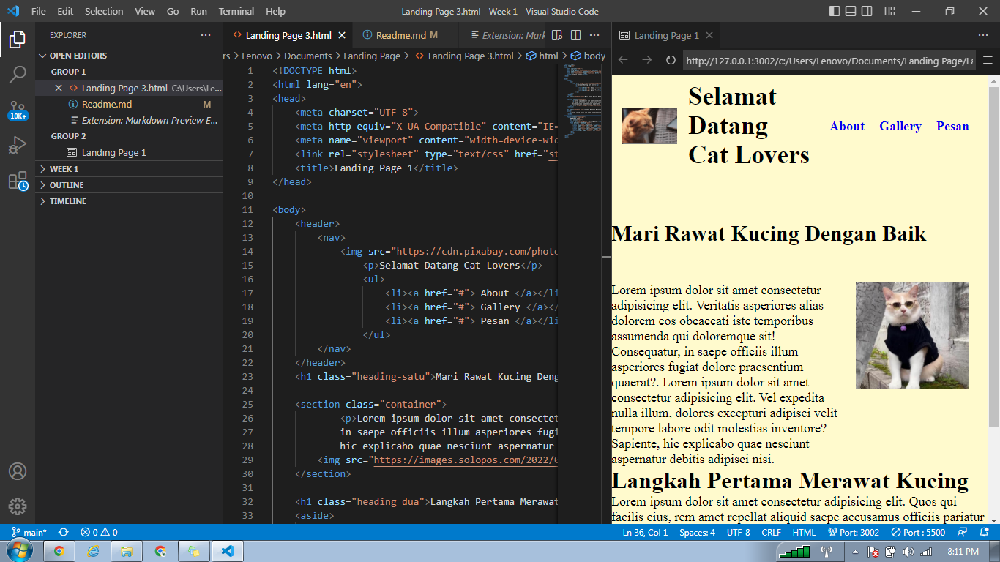

# Rangkuman Minggu Pertama SKILVUL

## UNIX COMMAND LINE

1. **CLI (Command Line Interface)** adalah baris perintah dari user melakukan perintah berbasis teks dengan berinteraksi dengan shell untuk melakukan perintah ke system operasi.

2. **Shell** adalah program berbasis teks antara user dengan system operasi, sebagai penerjemah menerima lalu memproses ke system untuk dieksekusi.
3. **Terminal** adalah tempat untuk mengetikan perintah teks ke system operasi dan akan diterjemahkan oleh shell.
4. **File System Structure** adalah penyusunan struktur file dan folder dalam bentuk pohon. contohnya seperti ini :
> 
5. **Mengakses CLI**
Klik logo windows dan ketik Cmd.exe maka hasil akan seperti dibawah :
> 
6. **Command** 
- ***pwd (Print Working Directory)***  Melihat Directory yang sedang bekerja.
- ***dir*** melihat isi direktori
- ***cd (change directory)*** berpindah direktori
- ***ls (list)*** melihat isi file pada direktori
- ***mkdir (make directory)*** membuat direktori
- ***touch*** membuat file
- ***cp*** mengcopy file dan direktori
- ***mv*** memindahkan dan mengganti file atau folder
- ***rm*** menghapus file
- ***rm -r*** menghapus direktori

## Git dan Github

- **Git** Tools programmer sebagai visual control system dimana mencatat perubahan yang kita buat pada code baik individu maupun tim.
- **Github** Sebuah website yang digunakan programer untuk mengembangkan dan mendesign sebuah software. Selain Github ada ***Gitlab*** dan ***Bitbucket*** untuk penyimpanan hasil project dalam bentuk repository

### Kenapa harus menggunakan Git dan Github
Tujuan utamanya untuk dapat berkelaborasi dengan tim tanpa membuat file yang banyak. Dan dapat mengerjakan secara bersamaan tanpa harus menunggu satu sama lain sehingga proses pengerjaan jauh lebih cepat.

### Langkah - langkah pengunaan Git dan Github

1. Download Gitbash melalui [link GIT](https://git-scm.com "silahkan download GIT dahulu")
2. Buat Akun Github melalui [link GITHUB](https://github.com "Buat akun dulu ya :)")
3. Melakukan setup awal di git
```
git config global user.name "meilyanaanisa"
git config global user.email meilyanaanisa@gmail.com
```
4. git config --list = Check Setup apakah berhasil.
5. git init tugas-01 = Membuat Repository baru.
git init = Membuat Repository dengan folder yang sudah ada dari local penyimpanan.
6. git status = Mengcheck apakah ada perubahan pada file.
7. git add readme.md = menambahkan file/file yang sudah di rubah ke git.
git add . = menambahkan seluruh file di dalam folder ke git.
8. git commit -m "message" = menyimpan perubahan pada git.
```
git commit -m "commit minggu pertama satu"
```
9. git remote = menghubungkan repository Github dengan project local pada komputer. 
``` 
git remote add origin https://github.com/meilyanaanisa/Writing-and-Presentation-Test-Skilvul.git
```
10. git push -u origin main = mengirimkan file baru/perubahan kepada repository.
11. git branch -m main = merubah cabang master menjadi main, apabila sudah Main tidak perlu dirubah.
12. git log = melihat history perubahan pada git.
git log --online = melihat history dalam satu baris pada git.
13. git checkout = mengembalikan pada versi sebelumnya.
14. git merge = menyatukan perubahan yang telah dikembangkan pada github.
15. git clone = untuk mengambil repository dari Github.

## HTML

**HTML (Hyper Text Markup Language)** adalah bahasa komputer yang digunakan untuk membuat kerangka dalam halaman website. Menampilkan konten berupa text, image, video, link. HTML tidak bersifat statis karena menampilkan apa yang diminta oleh programer, dan HTML bukanlah bahasa pemograman sehingga tidak bisa dinamis dalam mengolah data. Ada dua tools yang dibutuhkan dalam pembuatan HTML yaitu:
- Code Editor : menuliskan semua tag sintax html
- Browser : Melihat hasil pembuatan html

### Struktur HTML
```
<!DOCTYPE html>
<html lang="en">
<head>
    <meta charset="UTF-8">
    <meta http-equiv="X-UA-Compatible" content="IE=edge">
    <meta name="viewport" content="width=device-width, initial-scale=1.0">
    <title>Document</title>
</head>
<body>
    
</body>
</html>
```
1. **!DOCTYPE html** Mendeklarasikan atau mengidentifikasi jenis HTML yang digunakan pada browser.
2. **html lang="en"** Mendeklarasikan bahasa halaman web untuk memudahkan pencarian pada search engines dan browser.
3. **head** Element untuk metadata yang dapat mendefinisikan title, character set, style, scripts, dan metadata informasi lainnya.
4. **body** Mendefinisikan document pada halaman berupa content seperti heading, paragraph, image, hyperlink, table, dll

### Menjalankan HTML langsung di Visual Studio Code
Dengan menjalankan html secara langsung memudahkan kita mengetahui perubahan yang kita buat tanpa harus melakukan refresh berkali kali.
Kita bisa memanfaatkan extension pada Vscode bernama **Live Server**.


### Penggunaan Semantik HTML
Dengan Semantik HTML menjadikan tag lebih user freindly dan gampang di implentasikan. Serta memudahkan dalam pencarian di search engine

- header : Kepala web
- nav : Membuat Navigasi
- footer : Bagian kaki web
- section : Membuat bagian artikel
- aside : Membuat bagian samping
- article : Membuat elemen artikel

### Hosting Web Menggunakan Netlify
1. Mendaftar akun baru, bisa menggunakan akun Github tinggal disambungkan. [link Netlify](https://app.netlify.com/signup?_ga=2.42873893.1254162688.1664112300-1019109604.1664112300 "Hosting Web")
2. Add A New Project, pastikan repository sudah di push terlebih dahulu di Github.
3. Authorize Application, Mengizinkan Netlify dan Github saling terhubung.
4. Memilih repository yang akan di deploy.
5. Configure Your Setting. pastikan dalam publish direktori dengan publish directory **e.g dist**
6. Tunggu hingga selesai 

## CSS (Cascading Style Sheet)
Menambahkan design ke suatu halaman website. Dengan ada css tampilan jauh lebih baik.

### Bagaimana sih menyisipkan css pada HTML
Ada tiga cara yang dapat dilakukan, yaitu :
1. Inline CSS, yaitu menggunakan attribute style untuk menyisipkan kode CSS langsung di dalam HTML element.
```
 <h1 style="color:blue;">Apa Kabar Dunia?</h1>
 ```
2. Internal CSS, yaitu menggunakan element style untuk menyisipkan kode CSS. Element style tersebut diletakkan di dalam element.
```
  <style>
      h1 {
      background-color: black;
      }
    </style> 
```
3. External CSS, Kita memiliki dua file: index.html untuk file HTML-nya dan styles.css untuk file CSS-nya.
```
<!-- File index.html -->
<!DOCTYPE html>
<html>
  <head>
    <title>Website Pertamaku</title>
    <link rel="stylesheet" href="styles.css" />
  </head>
  <body>
    <h1>Website Pertamaku</h1>
    <p>Selamat Datang</p>
  </body>
</html>

/* File styles.css */
body {
  background-color: maroon;
}
h1 {
  color: yellow;
}
p {
  color: black;
}
```
### Syntax pada CSS
Menunjukan atau memilih HTML element mana yang ingin diberi Style. Syntax CSS terdiri dari selector, properties dan value.
```
p {
  color: blue;
} 
```
- p bertindak sebagai selector, element html yang akan dihias.
- color bertindak sebagai properties, bagian mana yang akan dihias.
- blue bertindak sebagai nilai, nilai atau berupa hiasan apa yang akan diberikan
### CSS Responsive
Membuat tampilan tetap bagus dan rapih di semua device.
- memberikan instruksi ke browser bagaimana mengatur dimensi lebar dan tinggi halaman tanpa merubah content
```
<meta name="viewport" content="width=device-width, initial-scale=1.0">
```
### Apa itu Flexbox
Mengatur tampilan tata letak layout pada halaman html.

- Block, memenuhi layout satu baris tanpa memberikan space untuk kata sebelahnya.
- inline memberikan layout sesuai isi content.
- display : flex, memberikan tampilan menjadi fleksibel.
- flex-direction : memberikan arah layout ingin vertical atau horizontal.
- Justify-content : meluruskan tata letak antar item.
- align-items : sama halnya dengan justify content dapat menyelaraskan tata letak antar item.
- flex-container : element utama yang membungkus element didalamnya menjadi fleksibel.

