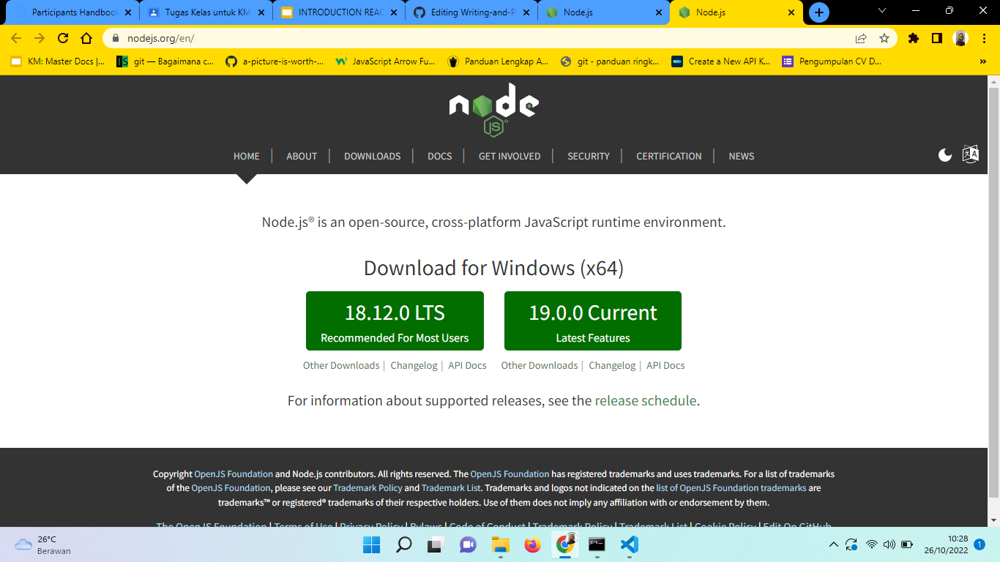
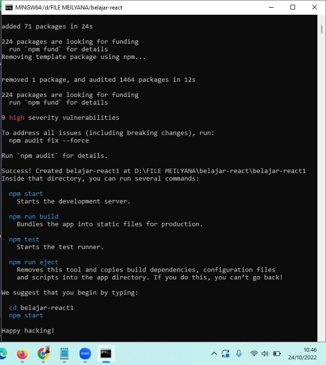
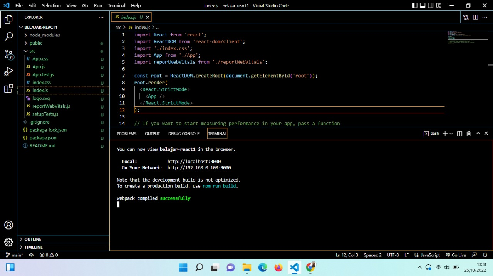

# Rangkuman Materi Minggu ke-6 di Skilvul

## Reactjs

- React js dibuat oleh Jordan Walke Seorang Tim Engineer Facebook.
- React js bukanlah sebuah framework melainkan library JavaScript untuk membuat tampilan User Interface pada web browser.
- Konsep modular JavaScript pada Reactjs dimana membagi 1 tampilan pada website menjadi komponen-komponen kecil.
- Salah satu konsep react yaitu learn one, write anywhere. kita hanya perlu membuatnya sekali dan dapat dipanggil berkali kali.
- Hal yang harus disiapkan sebelum menggunakan Reactjs yaitu menginstall [Node Js](https://nodejs.org "Link Nodejs"), agar dapat menginstall package yang sudah disediakan oleh JavaScript.
- Pilih Versi LTS

- Lalu lakukan installation seperti biasa setelah di download
- Untuk mengetahui apakah sudah berhasil install di gitbash.
> node -v
- Check versi npm
> npm -v
- Menggunakan Library 
> npx create-react-app my-app
- Proses berhasil unduh react akan tampil seperti ini.

- Tampilan workspace react.js yang telah diinstall.

- Menjalankan react ke web browser
> npm start
- Sudah mauk ke tahap deployment web
> npm run build
- Tag HTML di dalam JavaScript disebut dengan jsx.
- Development dilakukan di dalam folder src.
- Setiap jsx hanya bisa memiliki satu parent element atau pembungkus element. 
- Gunakan tag div atau tag fragment kosong sebagai pembungkusnya.
- Dengan menggunakan react saat update data maka hanya melakukan render ulang pada komponen tersebut sehingga menjadi lebih cepat dalam performance.
- Atribute class pada jx harus menggunakan className.

```
import React from 'react';

function perkenalan (){
    return{
        <div>
        <h1 className="tittle>Selamat Datang</h1>
        <p className="description>Ini adalah website pertama menggunakan reactjs</p>
        </div>
    }
}

export default perkenalan;
```

- Menyelipkan syntax JavaScript ke dalam jsx menggunakan curly braces {}.

```
import React from 'react';

function perkenalan (){
    return{
        <div>
        <h1>{1 + 2}</h1>
        </div>
    }
}

export default perkenalan;
```
- Akses variabel menggunakan curly braces
```
import React from 'react';

function perkenalan (){
    return{
        <div>
        <h1>{1 + 2}</h1>
        </div>
    }
}

export default perkenalan;
```
- Akses variabel menggunakan curly braces
```
import React from 'react';

function perkenalan (){
    const nama = 'meilyana'
    return{
        <div>
        <h1>{nama}</h1>
        <p>{nama.lowerUpperCase</p>
        </div>
    }
}

export default perkenalan;
```
## Component 

- Component adalah salah satu core React Js yang dapat membagi UI dalam satuan-satuan kecil.
- Misal : didalam HTML terdapat navbar, form, text title. Mereka disebut component
- Ada dua cara membuat component

  - Guanakn function
  - Gunakan class

-